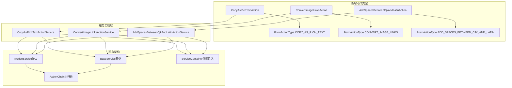
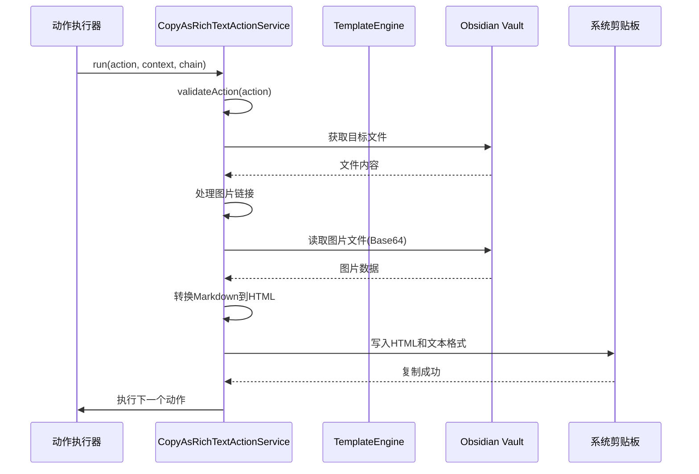
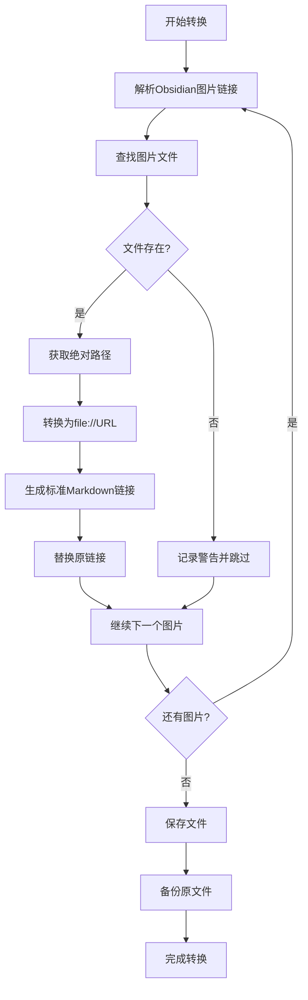
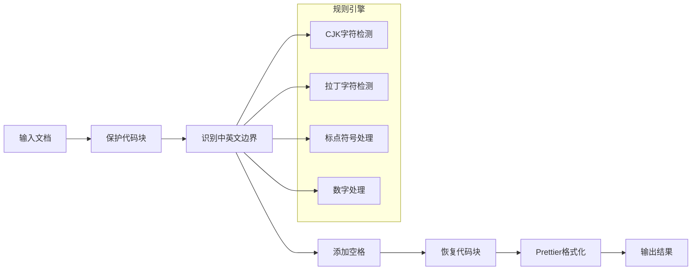

# Form Flow插件命令执行增强设计文档

## 概述

本设计文档旨在为Form Flow插件的动作系统（Action System）中的命令执行（Command Execution）模块添加三个新的动作类型，以增强插件的文档处理能力。这三个新功能将完全遵循现有的架构模式，确保与现有系统的无缝集成。

### 新增功能概览

1. **复制为富文本动作** - 将Markdown文档内容转换为HTML格式并复制到系统剪贴板
2. **转换图片链接动作** - 将Obsidian内部图片链接格式转换为标准Markdown图片链接
3. **中英文加空格动作** - 在中文和英文字符之间自动添加空格以提高可读性

### 执行模式支持

每个动作都支持两种执行模式：
- **当前文件模式** (`current`) - 对当前活动的编辑器文件执行操作
- **指定文件模式** (`specified`) - 对用户指定的文件路径执行操作

## 技术架构

### 核心设计原则

1. **架构一致性** - 严格遵循现有的`IActionService`接口设计
2. **依赖注入** - 使用现有的服务注册机制
3. **错误处理** - 继承现有的`BaseService`并使用统一的错误处理机制
4. **向下兼容** - 不修改现有代码结构，仅进行扩展

### 架构图



## 数据模型设计

### 枚举类型扩展

```typescript
// src/model/enums/FormActionType.ts
export enum FormActionType {
    // ... 现有枚举值
    COPY_AS_RICH_TEXT = "copyAsRichText",
    CONVERT_IMAGE_LINKS = "convertImageLinks", 
    ADD_SPACES_BETWEEN_CJK_AND_LATIN = "addSpacesBetweenCjkAndLatin"
}
```

### 动作配置接口

#### 复制为富文本动作配置

```typescript
// src/model/action/CopyAsRichTextFormAction.ts
export interface ICopyAsRichTextFormAction extends IFormAction {
    type: FormActionType.COPY_AS_RICH_TEXT;
    targetMode: 'current' | 'specified';
    filePath?: string;
    includeImages: boolean;
    maxImageSize?: number; // MB, 默认10MB
    imageQuality?: number; // 0-100, 默认85
}
```

#### 转换图片链接动作配置

```typescript
// src/model/action/ConvertImageLinksFormAction.ts
export interface IConvertImageLinksFormAction extends IFormAction {
    type: FormActionType.CONVERT_IMAGE_LINKS;
    targetMode: 'current' | 'specified';
    filePath?: string;
    backupOriginal: boolean;
    preserveDisplayText: boolean; // 是否保留显示文本
}
```

#### 中英文加空格动作配置

```typescript
// src/model/action/AddSpacesBetweenCjkAndLatinFormAction.ts
export interface IAddSpacesBetweenCjkAndLatinFormAction extends IFormAction {
    type: FormActionType.ADD_SPACES_BETWEEN_CJK_AND_LATIN;
    targetMode: 'current' | 'specified';
    filePath?: string;
    tabWidth: '2' | '4';
    formatEmbeddedCode: boolean;
    preserveCodeBlocks: boolean; // 是否保护代码块内容
}
```

## 服务实现层设计

### 复制为富文本服务



#### 核心转换逻辑

**图片Base64嵌入**
```typescript
private async convertImagesToBase64(content: string, file: TFile): Promise<string> {
    const imageRegex = /!\[\[([^\]]*?)(\|[^\]]*?)?\]\]/g;
    let result = content;
    
    const matches = [...content.matchAll(imageRegex)];
    for (const match of matches) {
        const imagePath = match[1];
        const displayText = match[2]?.substring(1) || imagePath;
        
        try {
            const imageFile = this.findImageFile(imagePath, file);
            if (imageFile && this.isValidImageSize(imageFile)) {
                const arrayBuffer = await this.app.vault.readBinary(imageFile);
                const base64 = this.arrayBufferToBase64(arrayBuffer);
                const mimeType = this.getMimeType(imagePath);
                
                const replacement = ``;
                result = result.replace(match[0], replacement);
            }
        } catch (error) {
            this.debugLog(`图片处理失败: ${imagePath}`, error);
        }
    }
    
    return result;
}
```

**MIME类型检测**
```typescript
private getMimeType(filename: string): string {
    const ext = filename.toLowerCase().split('.').pop();
    const mimeTypes = {
        'png': 'image/png',
        'jpg': 'image/jpeg',
        'jpeg': 'image/jpeg',
        'gif': 'image/gif',
        'webp': 'image/webp',
        'svg': 'image/svg+xml'
    };
    return mimeTypes[ext] || 'image/png';
}
```

### 转换图片链接服务



#### 路径转换逻辑

```typescript
private async convertImageLinks(content: string, sourceFile: TFile): Promise<string> {
    const imageRegex = /!\[\[([^\]]*?)(\|([^\]]*?))?\]\]/g;
    let result = content;
    
    const matches = [...content.matchAll(imageRegex)];
    for (const match of matches) {
        const imagePath = match[1];
        const displayText = match[3] || imagePath;
        
        try {
            const imageFile = this.findImageFile(imagePath, sourceFile);
            if (imageFile) {
                const absolutePath = this.app.vault.adapter.getFullPath(imageFile.path);
                const fileUrl = this.pathToFileUrl(absolutePath);
                const replacement = ``;
                result = result.replace(match[0], replacement);
            }
        } catch (error) {
            this.debugLog(`图片链接转换失败: ${imagePath}`, error);
        }
    }
    
    return result;
}

private pathToFileUrl(absolutePath: string): string {
    // Windows路径处理
    if (absolutePath.match(/^[A-Z]:\\/)) {
        return `file:///${absolutePath.replace(/\\/g, '/')}`;
    }
    // Unix路径处理  
    return `file://${absolutePath}`;
}
```

### 中英文加空格服务



#### 格式化核心算法

```typescript
private formatContent(content: string, options: {
    tabWidth: '2' | '4';
    formatEmbeddedCode: boolean;
    preserveCodeBlocks: boolean;
}): string {
    let result = content;
    
    // 1. 保护代码块
    const codeBlocks = [];
    if (options.preserveCodeBlocks) {
        result = result.replace(/```[\s\S]*?```/g, (match, index) => {
            const placeholder = `__CODE_BLOCK_${codeBlocks.length}__`;
            codeBlocks.push(match);
            return placeholder;
        });
    }
    
    // 2. 中英文间添加空格
    result = this.addSpacesBetweenCjkAndLatin(result);
    
    // 3. 恢复代码块
    if (options.preserveCodeBlocks) {
        codeBlocks.forEach((block, index) => {
            result = result.replace(`__CODE_BLOCK_${index}__`, block);
        });
    }
    
    return result;
}

private addSpacesBetweenCjkAndLatin(text: string): string {
    // CJK字符范围
    const cjkRegex = /[\u4e00-\u9fff\u3400-\u4dbf\uf900-\ufaff\u3040-\u309f\u30a0-\u30ff]/;
    // 拉丁字符范围  
    const latinRegex = /[a-zA-Z0-9]/;
    
    return text.replace(
        /([\u4e00-\u9fff\u3400-\u4dbf\uf900-\ufaff\u3040-\u309f\u30a0-\u30ff])([a-zA-Z0-9])/g,
        '$1 $2'
    ).replace(
        /([a-zA-Z0-9])([\u4e00-\u9fff\u3400-\u4dbf\uf900-\ufaff\u3040-\u309f\u30a0-\u30ff])/g,
        '$1 $2'
    );
}
```

## 依赖管理与集成

### 新增依赖

```json
{
  "dependencies": {
    "prettier": "^2.8.0"
  }
}
```

### 服务注册

```typescript
// src/service/action/IActionService.ts (ActionChain类中)
private actionServices: IActionService[] = [
    // ... 现有服务
    new CopyAsRichTextActionService(),
    new ConvertImageLinksActionService(),
    new AddSpacesBetweenCjkAndLatinActionService(),
]
```

## 错误处理与用户体验

### 错误类型与处理策略

```typescript
class CommandExecutionError extends Error {
    constructor(
        public actionType: string,
        public errorCode: string,
        message: string,
        public details?: any
    ) {
        super(message);
    }
}

// 错误处理示例
private async handleFileOperationError(error: Error, filePath: string): Promise<void> {
    const errorMessage = `文件操作失败: ${filePath}`;
    this.debugLog(errorMessage, { error: error.message, stack: error.stack });
    
    if (error.message.includes('ENOENT')) {
        throw new CommandExecutionError(
            this.actionType,
            'FILE_NOT_FOUND',
            `指定的文件不存在: ${filePath}`
        );
    } else if (error.message.includes('EACCES')) {
        throw new CommandExecutionError(
            this.actionType,
            'PERMISSION_DENIED', 
            `没有权限访问文件: ${filePath}`
        );
    } else {
        throw new CommandExecutionError(
            this.actionType,
            'UNKNOWN_ERROR',
            errorMessage,
            error
        );
    }
}
```

### 用户反馈机制

```typescript
// 进度提示
private showProgress(current: number, total: number, operation: string): void {
    const percent = Math.round((current / total) * 100);
    new Notice(`${operation}: ${percent}% (${current}/${total})`);
}

// 成功提示
private showSuccess(actionType: string, details?: string): void {
    const message = details 
        ? `✅ ${actionType}完成: ${details}`
        : `✅ ${actionType}执行成功`;
    new Notice(message);
}
```

## 性能优化策略

### 内存管理

```typescript
class MemoryOptimizedProcessor {
    private readonly MAX_FILE_SIZE = 50 * 1024 * 1024; // 50MB
    private readonly CHUNK_SIZE = 1024 * 1024; // 1MB
    
    async processLargeFile(file: TFile): Promise<string> {
        const fileSize = file.stat.size;
        
        if (fileSize > this.MAX_FILE_SIZE) {
            throw new Error(`文件过大: ${fileSize} bytes, 最大支持: ${this.MAX_FILE_SIZE} bytes`);
        }
        
        if (fileSize > this.CHUNK_SIZE) {
            return this.processInChunks(file);
        } else {
            return this.app.vault.cachedRead(file);
        }
    }
    
    private async processInChunks(file: TFile): Promise<string> {
        // 分块处理逻辑
        let result = '';
        const buffer = await this.app.vault.readBinary(file);
        
        for (let offset = 0; offset < buffer.byteLength; offset += this.CHUNK_SIZE) {
            const chunk = buffer.slice(offset, offset + this.CHUNK_SIZE);
            const text = new TextDecoder().decode(chunk);
            result += this.processChunk(text);
            
            // 让出控制权，避免阻塞UI
            await new Promise(resolve => setTimeout(resolve, 0));
        }
        
        return result;
    }
}
```

### 缓存机制

```typescript
class ImageCache {
    private cache = new Map<string, string>();
    private readonly MAX_CACHE_SIZE = 100;
    
    async getBase64Image(imagePath: string, file: TFile): Promise<string> {
        const cacheKey = `${file.path}:${imagePath}`;
        
        if (this.cache.has(cacheKey)) {
            return this.cache.get(cacheKey)!;
        }
        
        const base64 = await this.convertToBase64(imagePath, file);
        
        if (this.cache.size >= this.MAX_CACHE_SIZE) {
            const firstKey = this.cache.keys().next().value;
            this.cache.delete(firstKey);
        }
        
        this.cache.set(cacheKey, base64);
        return base64;
    }
}
```

## 测试策略

### 单元测试覆盖

```typescript
describe('CopyAsRichTextActionService', () => {
    let service: CopyAsRichTextActionService;
    let mockApp: App;
    let mockContext: ActionContext;
    
    beforeEach(() => {
        service = new CopyAsRichTextActionService();
        mockApp = createMockApp();
        mockContext = createMockActionContext();
    });
    
    test('应该正确转换Obsidian图片链接为Base64', async () => {
        const content = '这是一个图片: ![[test.png]]';
        const mockFile = createMockFile('test.md', content);
        
        const result = await service.convertToHtml(content, mockFile);
        
        expect(result).toContain(' {
        const action: ICopyAsRichTextFormAction = {
            id: 'test',
            type: FormActionType.COPY_AS_RICH_TEXT,
            targetMode: 'current',
            includeImages: true,
            maxImageSize: 1 // 1MB限制
        };
        
        // 模拟大图片文件
        const largeImageFile = createMockFile('large.png', 'x'.repeat(2 * 1024 * 1024));
        
        await expect(service.run(action, mockContext, mockChain))
            .rejects.toThrow('图片文件过大');
    });
});
```

### 集成测试

```typescript
describe('命令执行增强集成测试', () => {
    test('应该完整执行复制为富文本工作流', async () => {
        const formConfig = createTestFormConfig();
        const actionChain = new ActionChain([
            createCopyAsRichTextAction(),
            createNotificationAction()
        ]);
        
        const context = createIntegrationTestContext();
        await actionChain.next(context);
        
        // 验证剪贴板内容
        const clipboardContent = await navigator.clipboard.readText();
        expect(clipboardContent).toContain('<html>');
        
        // 验证通知显示
        expect(mockNotice.lastMessage).toBe('✅ 复制为富文本完成');
    });
});
```

## 部署与维护

### 向后兼容性

所有新增功能都不会影响现有的动作类型和配置，确保现有用户的表单配置继续正常工作。

### 文档更新

需要更新以下文档：
1. 用户手册 - 新增动作类型的使用说明
2. API文档 - 新增接口和配置选项
3. 示例配置 - 提供常用场景的配置模板

### 监控与日志

```typescript
class PerformanceMonitor {
    private metrics = new Map<string, number[]>();
    
    recordExecutionTime(actionType: string, duration: number): void {
        if (!this.metrics.has(actionType)) {
            this.metrics.set(actionType, []);
        }
        
        this.metrics.get(actionType)!.push(duration);
        
        // 保持最近100次记录
        const records = this.metrics.get(actionType)!;
        if (records.length > 100) {
            records.shift();
        }
    }
    
    getAverageExecutionTime(actionType: string): number {
        const records = this.metrics.get(actionType) || [];
        return records.length > 0 
            ? records.reduce((sum, time) => sum + time, 0) / records.length 
            : 0;
    }
}
```