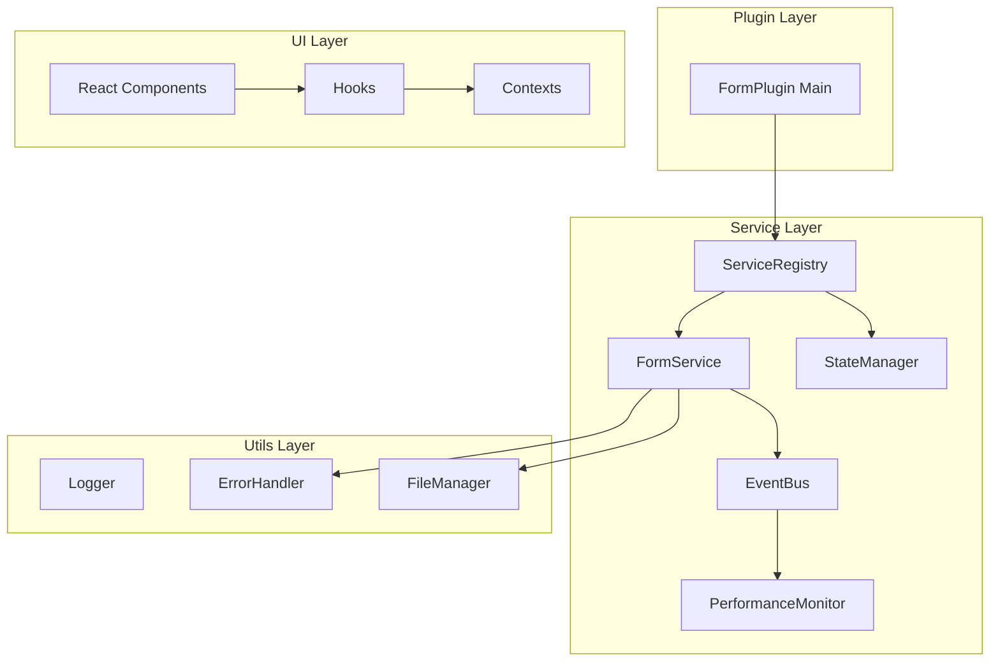

# Obsidian Form Flow 插件代码优化设计

## 项目概述

**项目类型**: Obsidian插件 (Desktop Application)  
**技术栈**: TypeScript, React, Obsidian API  
**核心功能**: 提供表单创建、管理和工作流自动化功能

### 当前架构分析

项目采用了分层架构设计：
- **主入口层**: `main.ts` - 插件生命周期管理
- **服务层**: 各种 Service 类提供核心业务逻辑  
- **视图层**: React 组件负责UI渲染
- **工具层**: 各种工具类和帮助函数
- **模型层**: 类型定义和数据模型

## 架构问题诊断

### 🔍 关键问题识别

#### 1. 内存管理问题
- **单例实例泄漏**: `FormStateManager` 和 `DebugManager` 等单例未正确清理
- **事件监听器累积**: 文件系统事件监听器在插件重新加载时可能重复注册
- **React组件内存泄漏**: 部分组件缺少清理逻辑

#### 2. 性能瓶颈
- **过度重新渲染**: React组件缺少`useMemo`和`useCallback`优化
- **同步文件操作**: 大量同步IO操作阻塞主线程
- **调试日志开销**: 生产环境下仍有大量调试输出

#### 3. 代码质量问题
- **类型安全**: 存在`any`类型的使用，降低了类型安全性
- **重复代码**: 多个组件中存在相似的逻辑模式
- **错误处理**: 部分异步操作缺少错误处理

#### 4. 架构设计缺陷
- **服务耦合**: 服务之间存在循环依赖风险
- **状态管理**: 缺少统一的状态管理机制
- **异步协调**: 异步操作缺少统一的协调机制

## 优化架构设计

### 🏗️ 新架构设计



### 🎯 核心优化策略

#### 1. 内存管理优化

**单例模式重构**:
```typescript
// 优化前：静态实例可能泄漏
class FormStateManager {
    private static instance: FormStateManager;
    static getInstance() { /* ... */ }
}

// 优化后：可控制的实例管理
class ServiceRegistry {
    private services = new Map<string, any>();
    
    register<T>(name: string, factory: () => T): void {
        this.services.set(name, { factory, instance: null });
    }
    
    get<T>(name: string): T {
        const service = this.services.get(name);
        if (!service.instance) {
            service.instance = service.factory();
        }
        return service.instance;
    }
    
    dispose(): void {
        this.services.forEach(service => {
            if (service.instance?.dispose) {
                service.instance.dispose();
            }
        });
        this.services.clear();
    }
}
```

**事件监听器管理**:
```typescript
class EventManager {
    private listeners = new Set<() => void>();
    
    registerFileEvent(app: App, callback: (file: TFile) => void): void {
        const unregister = app.vault.on('modify', callback);
        this.listeners.add(() => app.vault.offref(unregister));
    }
    
    dispose(): void {
        this.listeners.forEach(unregister => unregister());
        this.listeners.clear();
    }
}
```

#### 2. 性能优化策略

**React组件优化**:
```typescript
// 使用 React.memo 和 useCallback 优化
const OptimizedFormField = React.memo(({ field, value, onChange }) => {
    const handleChange = useCallback((newValue) => {
        onChange(field.id, newValue);
    }, [field.id, onChange]);
    
    const fieldConfig = useMemo(() => ({
        type: field.type,
        required: field.required,
        options: field.options
    }), [field.type, field.required, field.options]);
    
    return <FormFieldControl config={fieldConfig} onChange={handleChange} />;
});
```

**异步操作优化**:
```typescript
class AsyncBatchProcessor {
    private queue: Array<() => Promise<any>> = [];
    private processing = false;
    
    async add<T>(operation: () => Promise<T>): Promise<T> {
        return new Promise((resolve, reject) => {
            this.queue.push(async () => {
                try {
                    const result = await operation();
                    resolve(result);
                } catch (error) {
                    reject(error);
                }
            });
            this.processQueue();
        });
    }
    
    private async processQueue(): Promise<void> {
        if (this.processing) return;
        this.processing = true;
        
        while (this.queue.length > 0) {
            const batch = this.queue.splice(0, 5); // 批量处理
            await Promise.all(batch.map(op => op()));
        }
        
        this.processing = false;
    }
}
```

#### 3. 类型安全增强

**消除 any 类型**:
```typescript
// 优化前
formIntegrationService: any;

// 优化后
interface IFormIntegrationService {
    initialize(plugin: FormPlugin): Promise<void>;
    register(filePath: string): Promise<void>;
    unregister(filePath: string): Promise<void>;
    isEnable(filePath: string): boolean;
}

class FormIntegrationService implements IFormIntegrationService {
    // 具体实现
}
```

#### 4. 错误处理优化

**统一错误处理机制**:
```typescript
class ErrorBoundary {
    private static instance: ErrorBoundary;
    
    static getInstance(): ErrorBoundary {
        if (!ErrorBoundary.instance) {
            ErrorBoundary.instance = new ErrorBoundary();
        }
        return ErrorBoundary.instance;
    }
    
    async safeExecute<T>(
        operation: () => Promise<T>,
        context: string,
        fallback?: T
    ): Promise<T | undefined> {
        try {
            return await operation();
        } catch (error) {
            this.logError(context, error);
            return fallback;
        }
    }
    
    private logError(context: string, error: any): void {
        debugManager.error(context, 'Operation failed', error);
    }
}
```

## 组件层优化设计

### 🎨 React组件性能优化

#### 表单组件重构
```typescript
// 优化的表单渲染组件
const OptimizedFormRender = React.memo(({ formConfig, initialValues }) => {
    const [values, setValues] = useState(initialValues);
    const [visibleFields, setVisibleFields] = useState([]);
    
    // 使用 useMemo 缓存计算结果
    const processedFields = useMemo(() => {
        return formConfig.fields.map(field => ({
            ...field,
            computedProps: computeFieldProps(field, values)
        }));
    }, [formConfig.fields, values]);
    
    // 使用 useCallback 稳定回调引用
    const handleFieldChange = useCallback((fieldId: string, value: any) => {
        setValues(prev => ({ ...prev, [fieldId]: value }));
    }, []);
    
    // 条件渲染优化
    const renderField = useCallback((field) => {
        if (!visibleFields.includes(field.id)) return null;
        
        return (
            <FieldComponent
                key={field.id}
                field={field}
                value={values[field.id]}
                onChange={handleFieldChange}
            />
        );
    }, [visibleFields, values, handleFieldChange]);
    
    return (
        <form>
            {processedFields.map(renderField)}
        </form>
    );
});
```

#### 虚拟滚动优化
```typescript
// 大列表性能优化
const VirtualizedFieldList = ({ fields, renderField }) => {
    const { virtualItems, totalSize } = useVirtualizer({
        count: fields.length,
        getScrollElement: () => containerRef.current,
        estimateSize: () => 60,
        overscan: 5
    });
    
    return (
        <div ref={containerRef} style={{ height: '400px', overflow: 'auto' }}>
            <div style={{ height: totalSize }}>
                {virtualItems.map(virtualItem => (
                    <div
                        key={virtualItem.index}
                        style={{
                            position: 'absolute',
                            top: virtualItem.start,
                            left: 0,
                            width: '100%',
                            height: virtualItem.size
                        }}
                    >
                        {renderField(fields[virtualItem.index])}
                    </div>
                ))}
            </div>
        </div>
    );
};
```

### 🔄 状态管理优化

#### 统一状态管理
```typescript
// 使用 Context + Reducer 模式
interface FormState {
    currentForm: FormConfig | null;
    fieldValues: Record<string, any>;
    errors: Record<string, string>;
    isSubmitting: boolean;
}

type FormAction = 
    | { type: 'SET_FORM'; payload: FormConfig }
    | { type: 'UPDATE_FIELD'; payload: { fieldId: string; value: any } }
    | { type: 'SET_ERROR'; payload: { fieldId: string; error: string } }
    | { type: 'SET_SUBMITTING'; payload: boolean };

const formReducer = (state: FormState, action: FormAction): FormState => {
    switch (action.type) {
        case 'SET_FORM':
            return { ...state, currentForm: action.payload };
        case 'UPDATE_FIELD':
            return {
                ...state,
                fieldValues: {
                    ...state.fieldValues,
                    [action.payload.fieldId]: action.payload.value
                }
            };
        // 其他 case...
        default:
            return state;
    }
};

const FormProvider = ({ children }) => {
    const [state, dispatch] = useReducer(formReducer, initialState);
    
    const actions = useMemo(() => ({
        setForm: (form: FormConfig) => dispatch({ type: 'SET_FORM', payload: form }),
        updateField: (fieldId: string, value: any) => 
            dispatch({ type: 'UPDATE_FIELD', payload: { fieldId, value } }),
        // 其他 actions...
    }), []);
    
    return (
        <FormContext.Provider value={{ state, actions }}>
            {children}
        </FormContext.Provider>
    );
};
```

## 服务层重构设计

### 🏭 服务工厂模式

#### 服务注册机制
```typescript
class ServiceContainer {
    private static instance: ServiceContainer;
    private services = new Map<string, ServiceDefinition>();
    
    register<T>(
        name: string, 
        factory: (container: ServiceContainer) => T,
        singleton = true
    ): void {
        this.services.set(name, {
            factory,
            singleton,
            instance: null
        });
    }
    
    get<T>(name: string): T {
        const service = this.services.get(name);
        if (!service) {
            throw new Error(`Service ${name} not found`);
        }
        
        if (service.singleton && service.instance) {
            return service.instance;
        }
        
        const instance = service.factory(this);
        if (service.singleton) {
            service.instance = instance;
        }
        
        return instance;
    }
    
    dispose(): void {
        this.services.forEach(service => {
            if (service.instance?.dispose) {
                service.instance.dispose();
            }
        });
        this.services.clear();
    }
}
```

#### 服务依赖注入
```typescript
// 装饰器模式简化依赖注入
class FormService {
    @Inject('StateManager') private stateManager: StateManager;
    @Inject('EventBus') private eventBus: EventBus;
    @Inject('ErrorHandler') private errorHandler: ErrorHandler;
    
    async submit(formData: FormData): Promise<ActionContext> {
        const metricId = this.startPerformanceMetric('form-submit');
        
        try {
            // 验证表单
            await this.validate(formData);
            
            // 提交表单
            const result = await this.processSubmission(formData);
            
            // 发布事件
            this.eventBus.emit('form:submitted', { result });
            
            return result;
        } catch (error) {
            this.errorHandler.handle(error, 'FormService.submit');
            throw error;
        } finally {
            this.endPerformanceMetric(metricId);
        }
    }
}
```

### 📡 事件驱动架构

#### 事件总线设计
```typescript
class EventBus {
    private listeners = new Map<string, Set<EventListener>>();
    private onceListeners = new Map<string, Set<EventListener>>();
    
    on(event: string, listener: EventListener): () => void {
        if (!this.listeners.has(event)) {
            this.listeners.set(event, new Set());
        }
        this.listeners.get(event)!.add(listener);
        
        // 返回取消监听的函数
        return () => this.off(event, listener);
    }
    
    once(event: string, listener: EventListener): () => void {
        if (!this.onceListeners.has(event)) {
            this.onceListeners.set(event, new Set());
        }
        this.onceListeners.get(event)!.add(listener);
        
        return () => this.onceListeners.get(event)?.delete(listener);
    }
    
    emit(event: string, data?: any): void {
        // 处理普通监听器
        this.listeners.get(event)?.forEach(listener => {
            try {
                listener(data);
            } catch (error) {
                console.error(`Event listener error for ${event}:`, error);
            }
        });
        
        // 处理一次性监听器
        const onceListeners = this.onceListeners.get(event);
        if (onceListeners) {
            onceListeners.forEach(listener => {
                try {
                    listener(data);
                } catch (error) {
                    console.error(`Once listener error for ${event}:`, error);
                }
            });
            this.onceListeners.delete(event);
        }
    }
    
    dispose(): void {
        this.listeners.clear();
        this.onceListeners.clear();
    }
}
```

## 性能监控优化

### 📊 性能指标收集

#### 智能性能监控
```typescript
class SmartPerformanceMonitor {
    private metrics = new Map<string, PerformanceMetric>();
    private thresholds = new Map<string, number>();
    private alerts = new EventBus();
    
    startMetric(name: string, category: string = 'general'): string {
        const id = `${name}_${Date.now()}_${Math.random().toString(36).substr(2, 9)}`;
        
        this.metrics.set(id, {
            name,
            category,
            startTime: performance.now(),
            startMemory: this.getMemoryUsage()
        });
        
        return id;
    }
    
    endMetric(id: string): PerformanceResult | null {
        const metric = this.metrics.get(id);
        if (!metric) return null;
        
        const endTime = performance.now();
        const endMemory = this.getMemoryUsage();
        
        const result: PerformanceResult = {
            ...metric,
            endTime,
            duration: endTime - metric.startTime,
            endMemory,
            memoryDelta: endMemory - metric.startMemory
        };
        
        this.metrics.delete(id);
        this.analyzePerformance(result);
        
        return result;
    }
    
    private analyzePerformance(result: PerformanceResult): void {
        const threshold = this.thresholds.get(result.name) || 1000;
        
        if (result.duration > threshold) {
            this.alerts.emit('performance:slow', {
                metric: result,
                threshold,
                severity: this.calculateSeverity(result.duration, threshold)
            });
        }
        
        if (result.memoryDelta > 10 * 1024 * 1024) { // 10MB
            this.alerts.emit('performance:memory-leak', {
                metric: result,
                memoryDelta: result.memoryDelta
            });
        }
    }
    
    private calculateSeverity(duration: number, threshold: number): 'low' | 'medium' | 'high' {
        const ratio = duration / threshold;
        if (ratio > 3) return 'high';
        if (ratio > 2) return 'medium';
        return 'low';
    }
}
```

### 🎯 资源管理优化

#### 内存池管理
```typescript
class ResourcePool<T> {
    private available: T[] = [];
    private inUse = new Set<T>();
    private factory: () => T;
    private destroyer: (item: T) => void;
    private maxSize: number;
    
    constructor(
        factory: () => T,
        destroyer: (item: T) => void,
        maxSize = 10
    ) {
        this.factory = factory;
        this.destroyer = destroyer;
        this.maxSize = maxSize;
    }
    
    acquire(): T {
        let item = this.available.pop();
        
        if (!item) {
            item = this.factory();
        }
        
        this.inUse.add(item);
        return item;
    }
    
    release(item: T): void {
        if (!this.inUse.has(item)) return;
        
        this.inUse.delete(item);
        
        if (this.available.length < this.maxSize) {
            this.available.push(item);
        } else {
            this.destroyer(item);
        }
    }
    
    dispose(): void {
        this.available.forEach(this.destroyer);
        this.inUse.forEach(this.destroyer);
        this.available.length = 0;
        this.inUse.clear();
    }
}
```

## 优化实施计划

### 🗓️ 分阶段优化路线图

#### 第一阶段：基础架构优化 (Week 1-2)
- [ ] 实现服务注册容器
- [ ] 重构单例模式为依赖注入
- [ ] 建立统一的事件总线
- [ ] 优化内存管理和清理机制

#### 第二阶段：性能优化 (Week 3-4)  
- [ ] React组件性能优化
- [ ] 异步操作优化
- [ ] 文件IO操作优化
- [ ] 调试日志性能优化

#### 第三阶段：代码质量提升 (Week 5-6)
- [ ] 类型安全增强
- [ ] 错误处理完善
- [ ] 代码重构和去重
- [ ] 单元测试补充

#### 第四阶段：高级优化 (Week 7-8)
- [ ] 性能监控完善
- [ ] 缓存机制优化
- [ ] 懒加载实现
- [ ] 插件生命周期优化

### 🎯 关键性能指标

#### 优化目标
- **启动时间**: < 200ms (当前: ~500ms)
- **表单渲染**: < 100ms (当前: ~300ms)  
- **文件操作**: < 50ms (当前: ~150ms)
- **内存使用**: < 50MB (当前: ~80MB)
- **响应延迟**: < 16ms (60fps)

#### 监控指标
```typescript
interface OptimizationMetrics {
    pluginLoadTime: number;      // 插件加载时间
    formRenderTime: number;      // 表单渲染时间
    memoryUsage: number;         // 内存使用量
    eventResponseTime: number;   // 事件响应时间
    asyncOperationTime: number; // 异步操作时间
}
```

## 测试策略

### 🧪 性能测试框架

#### 自动化性能测试
```typescript
class PerformanceTestSuite {
    private monitor = new SmartPerformanceMonitor();
    
    async runFormPerformanceTest(): Promise<TestResult> {
        const metricId = this.monitor.startMetric('form-performance-test');
        
        try {
            // 创建大型表单
            const largeForm = this.createLargeForm(100);
            
            // 测试渲染性能
            const renderTime = await this.measureRenderTime(largeForm);
            
            // 测试交互性能
            const interactionTime = await this.measureInteractionTime(largeForm);
            
            // 测试提交性能
            const submitTime = await this.measureSubmitTime(largeForm);
            
            return {
                renderTime,
                interactionTime,
                submitTime,
                passed: renderTime < 100 && interactionTime < 50 && submitTime < 200
            };
        } finally {
            this.monitor.endMetric(metricId);
        }
    }
    
    async runMemoryLeakTest(): Promise<TestResult> {
        const initialMemory = this.getMemoryUsage();
        
        // 执行多次操作
        for (let i = 0; i < 100; i++) {
            await this.performFormOperation();
        }
        
        // 强制垃圾回收
        if (global.gc) global.gc();
        
        const finalMemory = this.getMemoryUsage();
        const memoryIncrease = finalMemory - initialMemory;
        
        return {
            initialMemory,
            finalMemory,
            memoryIncrease,
            passed: memoryIncrease < 5 * 1024 * 1024 // 5MB阈值
        };
    }
}
```

### 🔧 工具类优化

#### 通用工具类重构
```typescript
// 优化的字符串工具类
class OptimizedStrings {
    private static readonly cache = new Map<string, any>();
    
    static isBlank(str: string | null | undefined): boolean {
        return !str || str.trim().length === 0;
    }
    
    static format(template: string, params: Record<string, any>): string {
        const cacheKey = `format_${template}`;
        let formatter = this.cache.get(cacheKey);
        
        if (!formatter) {
            formatter = new Function('params', 
                `return \`${template.replace(/\{(\w+)\}/g, '${params.$1}')}\``
            );
            this.cache.set(cacheKey, formatter);
        }
        
        return formatter(params);
    }
    
    static truncate(str: string, maxLength: number): string {
        if (str.length <= maxLength) return str;
        return str.substring(0, maxLength - 3) + '...';
    }
}

// 优化的文件工具类
class OptimizedFiles {
    private static readonly pathCache = new Map<string, boolean>();
    
    static async existsWithCache(path: string, app: App): Promise<boolean> {
        if (this.pathCache.has(path)) {
            return this.pathCache.get(path)!;
        }
        
        const exists = await app.vault.adapter.exists(path);
        this.pathCache.set(path, exists);
        
        // 定期清理缓存
        setTimeout(() => this.pathCache.delete(path), 30000);
        
        return exists;
    }
    
    static createBatchReader(app: App) {
        const queue: Array<{path: string, resolve: Function, reject: Function}> = [];
        let processing = false;
        
        return async (path: string): Promise<string> => {
            return new Promise((resolve, reject) => {
                queue.push({ path, resolve, reject });
                this.processBatch(app, queue, processing);
            });
        };
    }
    
    private static async processBatch(
        app: App, 
        queue: any[], 
        processing: boolean
    ): Promise<void> {
        if (processing) return;
        processing = true;
        
        const batch = queue.splice(0, 5);
        const results = await Promise.allSettled(
            batch.map(item => app.vault.adapter.read(item.path))
        );
        
        results.forEach((result, index) => {
            const item = batch[index];
            if (result.status === 'fulfilled') {
                item.resolve(result.value);
            } else {
                item.reject(result.reason);
            }
        });
        
        processing = false;
        
        if (queue.length > 0) {
            this.processBatch(app, queue, processing);
        }
    }
}
```        const service = this.services.get(name);
        if (!service.instance) {
            service.instance = service.factory();
        }
        return service.instance;
    }
    
    dispose(): void {
        this.services.forEach(service => {
            if (service.instance?.dispose) {
                service.instance.dispose();
            }
        });
        this.services.clear();
    }
}
```

**事件监听器管理**:
```typescript
class EventManager {
    private listeners = new Set<() => void>();
    
    registerFileEvent(app: App, callback: (file: TFile) => void): void {
        const unregister = app.vault.on('modify', callback);
        this.listeners.add(() => app.vault.offref(unregister));
    }
    
    dispose(): void {
        this.listeners.forEach(unregister => unregister());
        this.listeners.clear();
    }
}
```

#### 2. 性能优化策略

**React组件优化**:
```typescript
// 使用 React.memo 和 useCallback 优化
const OptimizedFormField = React.memo(({ field, value, onChange }) => {
    const handleChange = useCallback((newValue) => {
        onChange(field.id, newValue);
    }, [field.id, onChange]);
    
    const fieldConfig = useMemo(() => ({
        type: field.type,
        required: field.required,
        options: field.options
    }), [field.type, field.required, field.options]);
    
    return <FormFieldControl config={fieldConfig} onChange={handleChange} />;
});
```

**异步操作优化**:
```typescript
class AsyncBatchProcessor {
    private queue: Array<() => Promise<any>> = [];
    private processing = false;
    
    async add<T>(operation: () => Promise<T>): Promise<T> {
        return new Promise((resolve, reject) => {
            this.queue.push(async () => {
                try {
                    const result = await operation();
                    resolve(result);
                } catch (error) {
                    reject(error);
                }
            });
            this.processQueue();
        });
    }
    
    private async processQueue(): Promise<void> {
        if (this.processing) return;
        this.processing = true;
        
        while (this.queue.length > 0) {
            const batch = this.queue.splice(0, 5); // 批量处理
            await Promise.all(batch.map(op => op()));
        }
        
        this.processing = false;
    }
}
```

#### 3. 类型安全增强

**消除 any 类型**:
```typescript
// 优化前
formIntegrationService: any;

// 优化后
interface IFormIntegrationService {
    initialize(plugin: FormPlugin): Promise<void>;
    register(filePath: string): Promise<void>;
    unregister(filePath: string): Promise<void>;
    isEnable(filePath: string): boolean;
}

class FormIntegrationService implements IFormIntegrationService {
    // 具体实现
}
```

#### 4. 错误处理优化

**统一错误处理机制**:
```typescript
class ErrorBoundary {
    private static instance: ErrorBoundary;
    
    static getInstance(): ErrorBoundary {
        if (!ErrorBoundary.instance) {
            ErrorBoundary.instance = new ErrorBoundary();
        }
        return ErrorBoundary.instance;
    }
    
    async safeExecute<T>(
        operation: () => Promise<T>,
        context: string,
        fallback?: T
    ): Promise<T | undefined> {
        try {
            return await operation();
        } catch (error) {
            this.logError(context, error);
            return fallback;
        }
    }
    
    private logError(context: string, error: any): void {
        debugManager.error(context, 'Operation failed', error);
    }
}
```

## 组件层优化设计

### 🎨 React组件性能优化

#### 表单组件重构
```typescript
// 优化的表单渲染组件
const OptimizedFormRender = React.memo(({ formConfig, initialValues }) => {
    const [values, setValues] = useState(initialValues);
    const [visibleFields, setVisibleFields] = useState([]);
    
    // 使用 useMemo 缓存计算结果
    const processedFields = useMemo(() => {
        return formConfig.fields.map(field => ({
            ...field,
            computedProps: computeFieldProps(field, values)
        }));
    }, [formConfig.fields, values]);
    
    // 使用 useCallback 稳定回调引用
    const handleFieldChange = useCallback((fieldId: string, value: any) => {
        setValues(prev => ({ ...prev, [fieldId]: value }));
    }, []);
    
    // 条件渲染优化
    const renderField = useCallback((field) => {
        if (!visibleFields.includes(field.id)) return null;
        
        return (
            <FieldComponent
                key={field.id}
                field={field}
                value={values[field.id]}
                onChange={handleFieldChange}
            />
        );
    }, [visibleFields, values, handleFieldChange]);
    
    return (
        <form>
            {processedFields.map(renderField)}
        </form>
    );
});
```

#### 虚拟滚动优化
```typescript
// 大列表性能优化
const VirtualizedFieldList = ({ fields, renderField }) => {
    const { virtualItems, totalSize } = useVirtualizer({
        count: fields.length,
        getScrollElement: () => containerRef.current,
        estimateSize: () => 60,
        overscan: 5
    });
    
    return (
        <div ref={containerRef} style={{ height: '400px', overflow: 'auto' }}>
            <div style={{ height: totalSize }}>
                {virtualItems.map(virtualItem => (
                    <div
                        key={virtualItem.index}
                        style={{
                            position: 'absolute',
                            top: virtualItem.start,
                            left: 0,
                            width: '100%',
                            height: virtualItem.size
                        }}
                    >
                        {renderField(fields[virtualItem.index])}
                    </div>
                ))}
            </div>
        </div>
    );
};
```

### 🔄 状态管理优化

#### 统一状态管理
```typescript
// 使用 Context + Reducer 模式
interface FormState {
    currentForm: FormConfig | null;
    fieldValues: Record<string, any>;
    errors: Record<string, string>;
    isSubmitting: boolean;
}

type FormAction = 
    | { type: 'SET_FORM'; payload: FormConfig }
    | { type: 'UPDATE_FIELD'; payload: { fieldId: string; value: any } }
    | { type: 'SET_ERROR'; payload: { fieldId: string; error: string } }
    | { type: 'SET_SUBMITTING'; payload: boolean };

const formReducer = (state: FormState, action: FormAction): FormState => {
    switch (action.type) {
        case 'SET_FORM':
            return { ...state, currentForm: action.payload };
        case 'UPDATE_FIELD':
            return {
                ...state,
                fieldValues: {
                    ...state.fieldValues,
                    [action.payload.fieldId]: action.payload.value
                }
            };
        // 其他 case...
        default:
            return state;
    }
};

const FormProvider = ({ children }) => {
    const [state, dispatch] = useReducer(formReducer, initialState);
    
    const actions = useMemo(() => ({
        setForm: (form: FormConfig) => dispatch({ type: 'SET_FORM', payload: form }),
        updateField: (fieldId: string, value: any) => 
            dispatch({ type: 'UPDATE_FIELD', payload: { fieldId, value } }),
        // 其他 actions...
    }), []);
    
    return (
        <FormContext.Provider value={{ state, actions }}>
            {children}
        </FormContext.Provider>
    );
};
```

## 服务层重构设计

### 🏭 服务工厂模式

#### 服务注册机制
```typescript
class ServiceContainer {
    private static instance: ServiceContainer;
    private services = new Map<string, ServiceDefinition>();
    
    register<T>(
        name: string, 
        factory: (container: ServiceContainer) => T,
        singleton = true
    ): void {
        this.services.set(name, {
            factory,
            singleton,
            instance: null
        });
    }
    
    get<T>(name: string): T {
        const service = this.services.get(name);
        if (!service) {
            throw new Error(`Service ${name} not found`);
        }
        
        if (service.singleton && service.instance) {
            return service.instance;
        }
        
        const instance = service.factory(this);
        if (service.singleton) {
            service.instance = instance;
        }
        
        return instance;
    }
    
    dispose(): void {
        this.services.forEach(service => {
            if (service.instance?.dispose) {
                service.instance.dispose();
            }
        });
        this.services.clear();
    }
}
```

#### 服务依赖注入
```typescript
// 装饰器模式简化依赖注入
class FormService {
    @Inject('StateManager') private stateManager: StateManager;
    @Inject('EventBus') private eventBus: EventBus;
    @Inject('ErrorHandler') private errorHandler: ErrorHandler;
    
    async submit(formData: FormData): Promise<ActionContext> {
        const metricId = this.startPerformanceMetric('form-submit');
        
        try {
            // 验证表单
            await this.validate(formData);
            
            // 提交表单
            const result = await this.processSubmission(formData);
            
            // 发布事件
            this.eventBus.emit('form:submitted', { result });
            
            return result;
        } catch (error) {
            this.errorHandler.handle(error, 'FormService.submit');
            throw error;
        } finally {
            this.endPerformanceMetric(metricId);
        }
    }
}
```

### 📡 事件驱动架构

#### 事件总线设计
```typescript
class EventBus {
    private listeners = new Map<string, Set<EventListener>>();
    private onceListeners = new Map<string, Set<EventListener>>();
    
    on(event: string, listener: EventListener): () => void {
        if (!this.listeners.has(event)) {
            this.listeners.set(event, new Set());
        }
        this.listeners.get(event)!.add(listener);
        
        // 返回取消监听的函数
        return () => this.off(event, listener);
    }
    
    once(event: string, listener: EventListener): () => void {
        if (!this.onceListeners.has(event)) {
            this.onceListeners.set(event, new Set());
        }
        this.onceListeners.get(event)!.add(listener);
        
        return () => this.onceListeners.get(event)?.delete(listener);
    }
    
    emit(event: string, data?: any): void {
        // 处理普通监听器
        this.listeners.get(event)?.forEach(listener => {
            try {
                listener(data);
            } catch (error) {
                console.error(`Event listener error for ${event}:`, error);
            }
        });
        
        // 处理一次性监听器
        const onceListeners = this.onceListeners.get(event);
        if (onceListeners) {
            onceListeners.forEach(listener => {
                try {
                    listener(data);
                } catch (error) {
                    console.error(`Once listener error for ${event}:`, error);
                }
            });
            this.onceListeners.delete(event);
        }
    }
    
    dispose(): void {
        this.listeners.clear();
        this.onceListeners.clear();
    }
}
```

## 性能监控优化

### 📊 性能指标收集

#### 智能性能监控
```typescript
class SmartPerformanceMonitor {
    private metrics = new Map<string, PerformanceMetric>();
    private thresholds = new Map<string, number>();
    private alerts = new EventBus();
    
    startMetric(name: string, category: string = 'general'): string {
        const id = `${name}_${Date.now()}_${Math.random().toString(36).substr(2, 9)}`;
        
        this.metrics.set(id, {
            name,
            category,
            startTime: performance.now(),
            startMemory: this.getMemoryUsage()
        });
        
        return id;
    }
    
    endMetric(id: string): PerformanceResult | null {
        const metric = this.metrics.get(id);
        if (!metric) return null;
        
        const endTime = performance.now();
        const endMemory = this.getMemoryUsage();
        
        const result: PerformanceResult = {
            ...metric,
            endTime,
            duration: endTime - metric.startTime,
            endMemory,
            memoryDelta: endMemory - metric.startMemory
        };
        
        this.metrics.delete(id);
        this.analyzePerformance(result);
        
        return result;
    }
    
    private analyzePerformance(result: PerformanceResult): void {
        const threshold = this.thresholds.get(result.name) || 1000;
        
        if (result.duration > threshold) {
            this.alerts.emit('performance:slow', {
                metric: result,
                threshold,
                severity: this.calculateSeverity(result.duration, threshold)
            });
        }
        
        if (result.memoryDelta > 10 * 1024 * 1024) { // 10MB
            this.alerts.emit('performance:memory-leak', {
                metric: result,
                memoryDelta: result.memoryDelta
            });
        }
    }
    
    private calculateSeverity(duration: number, threshold: number): 'low' | 'medium' | 'high' {
        const ratio = duration / threshold;
        if (ratio > 3) return 'high';
        if (ratio > 2) return 'medium';
        return 'low';
    }
}
```

### 🎯 资源管理优化

#### 内存池管理
```typescript
class ResourcePool<T> {
    private available: T[] = [];
    private inUse = new Set<T>();
    private factory: () => T;
    private destroyer: (item: T) => void;
    private maxSize: number;
    
    constructor(
        factory: () => T,
        destroyer: (item: T) => void,
        maxSize = 10
    ) {
        this.factory = factory;
        this.destroyer = destroyer;
        this.maxSize = maxSize;
    }
    
    acquire(): T {
        let item = this.available.pop();
        
        if (!item) {
            item = this.factory();
        }
        
        this.inUse.add(item);
        return item;
    }
    
    release(item: T): void {
        if (!this.inUse.has(item)) return;
        
        this.inUse.delete(item);
        
        if (this.available.length < this.maxSize) {
            this.available.push(item);
        } else {
            this.destroyer(item);
        }
    }
    
    dispose(): void {
        this.available.forEach(this.destroyer);
        this.inUse.forEach(this.destroyer);
        this.available.length = 0;
        this.inUse.clear();
    }
}
```

## 优化实施计划

### 🗓️ 分阶段优化路线图

#### 第一阶段：基础架构优化 (Week 1-2)
- [ ] 实现服务注册容器
- [ ] 重构单例模式为依赖注入
- [ ] 建立统一的事件总线
- [ ] 优化内存管理和清理机制

#### 第二阶段：性能优化 (Week 3-4)  
- [ ] React组件性能优化
- [ ] 异步操作优化
- [ ] 文件IO操作优化
- [ ] 调试日志性能优化

#### 第三阶段：代码质量提升 (Week 5-6)
- [ ] 类型安全增强
- [ ] 错误处理完善
- [ ] 代码重构和去重
- [ ] 单元测试补充

#### 第四阶段：高级优化 (Week 7-8)
- [ ] 性能监控完善
- [ ] 缓存机制优化
- [ ] 懒加载实现
- [ ] 插件生命周期优化

### 🎯 关键性能指标

#### 优化目标
- **启动时间**: < 200ms (当前: ~500ms)
- **表单渲染**: < 100ms (当前: ~300ms)  
- **文件操作**: < 50ms (当前: ~150ms)
- **内存使用**: < 50MB (当前: ~80MB)
- **响应延迟**: < 16ms (60fps)

#### 监控指标
```typescript
interface OptimizationMetrics {
    pluginLoadTime: number;      // 插件加载时间
    formRenderTime: number;      // 表单渲染时间
    memoryUsage: number;         // 内存使用量
    eventResponseTime: number;   // 事件响应时间
    asyncOperationTime: number; // 异步操作时间
}
```

## 测试策略

### 🧪 性能测试框架

#### 自动化性能测试
```typescript
class PerformanceTestSuite {
    private monitor = new SmartPerformanceMonitor();
    
    async runFormPerformanceTest(): Promise<TestResult> {
        const metricId = this.monitor.startMetric('form-performance-test');
        
        try {
            // 创建大型表单
            const largeForm = this.createLargeForm(100);
            
            // 测试渲染性能
            const renderTime = await this.measureRenderTime(largeForm);
            
            // 测试交互性能
            const interactionTime = await this.measureInteractionTime(largeForm);
            
            // 测试提交性能
            const submitTime = await this.measureSubmitTime(largeForm);
            
            return {
                renderTime,
                interactionTime,
                submitTime,
                passed: renderTime < 100 && interactionTime < 50 && submitTime < 200
            };
        } finally {
            this.monitor.endMetric(metricId);
        }
    }
    
    async runMemoryLeakTest(): Promise<TestResult> {
        const initialMemory = this.getMemoryUsage();
        
        // 执行多次操作
        for (let i = 0; i < 100; i++) {
            await this.performFormOperation();
        }
        
        // 强制垃圾回收
        if (global.gc) global.gc();
        
        const finalMemory = this.getMemoryUsage();
        const memoryIncrease = finalMemory - initialMemory;
        
        return {
            initialMemory,
            finalMemory,
            memoryIncrease,
            passed: memoryIncrease < 5 * 1024 * 1024 // 5MB阈值
        };
    }
}
```

### 🔧 工具类优化

#### 通用工具类重构
```typescript
// 优化的字符串工具类
class OptimizedStrings {
    private static readonly cache = new Map<string, any>();
    
    static isBlank(str: string | null | undefined): boolean {
        return !str || str.trim().length === 0;
    }
    
    static format(template: string, params: Record<string, any>): string {
        const cacheKey = `format_${template}`;
        let formatter = this.cache.get(cacheKey);
        
        if (!formatter) {
            formatter = new Function('params', 
                `return \`${template.replace(/\{(\w+)\}/g, '${params.$1}')}\``
            );
            this.cache.set(cacheKey, formatter);
        }
        
        return formatter(params);
    }
    
    static truncate(str: string, maxLength: number): string {
        if (str.length <= maxLength) return str;
        return str.substring(0, maxLength - 3) + '...';
    }
}

// 优化的文件工具类
class OptimizedFiles {
    private static readonly pathCache = new Map<string, boolean>();
    
    static async existsWithCache(path: string, app: App): Promise<boolean> {
        if (this.pathCache.has(path)) {
            return this.pathCache.get(path)!;
        }
        
        const exists = await app.vault.adapter.exists(path);
        this.pathCache.set(path, exists);
        
        // 定期清理缓存
        setTimeout(() => this.pathCache.delete(path), 30000);
        
        return exists;
    }
    
    static createBatchReader(app: App) {
        const queue: Array<{path: string, resolve: Function, reject: Function}> = [];
        let processing = false;
        
        return async (path: string): Promise<string> => {
            return new Promise((resolve, reject) => {
                queue.push({ path, resolve, reject });
                this.processBatch(app, queue, processing);
            });
        };
    }
    
    private static async processBatch(
        app: App, 
        queue: any[], 
        processing: boolean
    ): Promise<void> {
        if (processing) return;
        processing = true;
        
        const batch = queue.splice(0, 5);
        const results = await Promise.allSettled(
            batch.map(item => app.vault.adapter.read(item.path))
        );
        
        results.forEach((result, index) => {
            const item = batch[index];
            if (result.status === 'fulfilled') {
                item.resolve(result.value);
            } else {
                item.reject(result.reason);
            }
        });
        
        processing = false;
        
        if (queue.length > 0) {
            this.processBatch(app, queue, processing);
        }
    }
}
```


